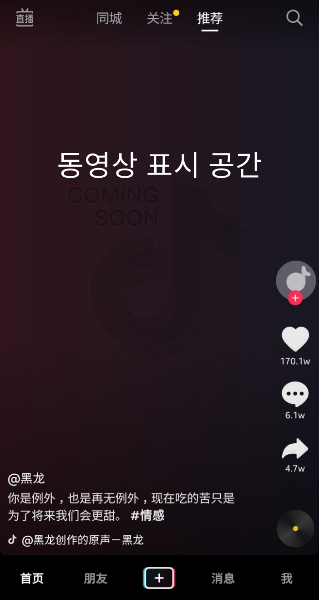

# 프록시 패턴
---

## 정의
어떤 객체를 사용하려고 할 때 이 객체를 직접 생성하여 참조하지 않고, 이를 대리해주는 객체를 생성하여 참조하는 방식이다. 이때 대리해주는 객체를 **프록시** 객체라고 한다. 프록시 객체 내부에서 클라이언트가 요청한 실제 객체(**타깃** 객체)를 생성하고 반환해준다. 

## 활용
1. **가상 프록시** : 그래픽 객체 등 비용이 많이 드는 객체를 로딩하기 전에 프록시 객체를 대신 넘겨주어 참조하도록 할 수 있다. 
 - Lazy initialization
2. **원격지 프록시** : 원격 오브젝트를 이용하는 경우에 편리하다. 
 - e.g. RMI나 EJB 등 리모팅 기술을 통해 다른 서버에 존재하는 오브젝트를 사용해야 할 경우
3. **보호용 프록시** : 사용자의 실제 객체에 대한 접근을 제어한다.
 - e.g. Collections의 `unmodifiableCollection()`을 통해 만들어지는 오브젝트
4. **스마트 프록시** : C와 C++ 같은 언매니지드 언어에서는 코더가 메모리 할당과 해제를 신경써서 메모리 릭을 방지해야 한다.
 - 복사 생성을 할 때 실제 객체에 참조 개수를 추가하고 소멸을 할 때에는 참조 개수를 감소시켜 참조 개수가 0이 되면 실제 객체를 소멸해주는 방식.

## 사용방법
### 가상 프록시의 사례
틱톡과 같은 쇼트 클립 어플리케이션을 개발한다고 가정하자. 영상이 로딩되기 전까지 로딩 아이콘을 띄워놓고, 그 밖에 가벼운 데이터는 클라이언트에게 빠르게 보여주고 싶다. 



먼저 연산이 오래 걸리는 객체를 생성하여 반환하는 기능을 가진 Loader 인터페이스를 선언한다. 
```kotlin
interface Loader {
    fun getData(): Data
}
```

Data 클래스는 연산이 오래 걸리는 객체로, 여기서는 쇼트 클립 객체가 될 것이다.
```kotlin
data class Data(var msg: String? = null, var isLoaded: Boolean = false)
```

Loader를 구현한 ShortClipLoader를 정의하였다. 클라이언트에서 실제 접근하고자 하는 타깃 클래스이다.
```kotlin
class ShortClipLoader: Loader {
    override fun getData(): Data {
        val shortClipMovie = Data()
        val timer = Timer()
        timer.schedule(object: TimerTask(){
            override fun run() {
                shortClipMovie.msg = "쇼트클립 영상"
                shortClipMovie.isLoaded = true
            }
        }, 5000)
        return shortClipMovie
    }
}
```

클라이언트가 타깃 객체로 직접 접근하지 못하도록 막고, 프록시 객체로 우회하여 타깃 객체로 접근토록 하기 위해서 같은 Loader 인터페이스를 구현한 ProxyLoader 클래스를 정의하였다.
```kotlin
class ProxyLoader : Loader {
    private var loader: Loader? = null
    override fun getData(): Data {
        if(loader == null){
            loader = ShortClipLoader()
        }
        println("텍스트 로딩 완료")
        println("아이콘 로딩 완료")
        return loader!!.getData()
    }
}
```

클라이언트는 타깃 객체 대신 프록시 객체를 생성하고, 프록시 객체에서 타깃 객체를 반환하는 `getData()` 메소드를 호출할 때, 그제서야 타깃 객체에 쇼트 클립 데이터를 요청하는 작업을 위임한다. 타깃 객체가 쇼트 클립 데이터를 처리하는 동안 프록시 객체는 텍스트, 아이콘 로딩 등 연산이 적은 데이터를 빨리 처리하여 화면에 먼저 띄울 수 있게 된다.
```kotlin
fun main() {
    val proxyLoader: Loader = ProxyLoader()
    println("대리인에게 로딩 요청!!")
    val data = proxyLoader.getData()
    println("작은 데이터를 로딩하였음. 큰 데이터의 로딩 완료를 기다린다.")
    while(data.isLoaded.not()){
        // 로딩 아이콘을 띄운다.
    }
    println("데이터 로딩 완료: ${data.msg}")
}
```

### 보호용 프록시의 사례
회원가입 기능을 구현하려고 한다. 회원의 아이디를 이메일 주소로 받으면서, 특정 도메인을 사용한 주소만 받아야 한다는 요구사항이 있다. 정책 상 허용된 도메인을 포함한 이메일 주소만 허용하고, 나머지는 예외처리를 해야한다. 이는 프록시 객체를 통해 허용된 도메인에 한해서만 타깃 객체에 접근 권한을 주도록 구현할 수 있다.

인증 처리를 하는 Authorizer 인터페이스를 정의한다.
```kotlin
interface Authorizer {
    fun authorize(email: String)
}
```

타깃 클래스를 구현한다. 사용 가능한 이메일에 한해서 인증 확인 메일을 전송하는 로직을 담고 있다.
```kotlin
class DomainAuthorizer : Authorizer {
    override fun authorize(email: String) {
        println("${email}은 사용 가능한 이메일 입니다.")
        sendAuthorizeMail()
    }

    private fun sendAuthorizeMail(){
        println("인증 확인 메일을 전송 합니다.")
    }
}
```

Authorizer 인터페이스를 구현한 프록시 클래스를 정의한다. 허용 가능한 도메인 리스트 여부에 따라 타깃 객체에 차후 인증 메일 전송을 위임할 것인지, 예외 처리할 것인지를 담당한다. 타깃 객체에 대한 접근 권한이 있는 클래스이다.
```kotlin
class ProxyAuthorizer: Authorizer {
    private val listPermissiveDomain = setOf("gmail.com", "naver.com", "hanmail.net")
    private val domainAuthorizer = DomainAuthorizer()

    override fun authorize(email: String) {
        val idx = email.indexOf("@")
        if(listPermissiveDomain.contains(email.substring(idx + 1))){
            domainAuthorizer.authorize(email)
        } else {
            println("해당 도메인을 지원하지 않습니다.")
        }
    }
}
```

클라이언트는 프록시 객체를 통해 도메인 지원 여부에 따라 타깃 객체에 간접적으로 접근할 수 있다.
```kotlin
fun main() {
    val authorizer = ProxyAuthorizer()
    authorizer.authorize("jjjlyn@gmail.com")
    authorizer.authorize("pikachu@naver.com")
    authorizer.authorize("doraemon@hanmail.net")
    authorizer.authorize("babo@hiworks.com")
}
```

결과
```
jjjlyn@gmail.com은 사용 가능한 이메일 입니다.
인증 확인 메일을 전송 합니다.

pikachu@naver.com은 사용 가능한 이메일 입니다.
인증 확인 메일을 전송 합니다.

doraemon@hanmail.net은 사용 가능한 이메일 입니다.
인증 확인 메일을 전송 합니다.

해당 도메인을 지원하지 않습니다.
```

### 주의
일반적으로 우리가 생각하는 프록시 용어와 디자인패턴에서의 프록시 패턴은 구분을 해야 할 필요가 있다. 
- 용어로서의 프록시 : 클라이언트와 사용 대상 사이에 대리 역할을 맡은 오브젝트를 두는 방법을 총칭한다.
- 데코레이션 패턴에서의 프록시 : 프록시를 사용하는 방법 중에서, 타깃 객체에 **특정 기능을 추가**하려는 목적을 가진 경우
```kotlin
val inputStream = BufferedInputStream(FileInputStream("random.txt"))
// InputStream이라는 인터페이스를 구현한 타깃인 FileInputStream에 버퍼 읽기 기능을 제공해주는 BufferedInputStream 프록시(데코레이터)를 적용한 것
```
- 디자인패턴에서의 프록시 패턴 : 프록시를 사용하는 방법 중에서, **타깃에 대한 접근 방법을 제어**하려는 목적을 가진 경우.
